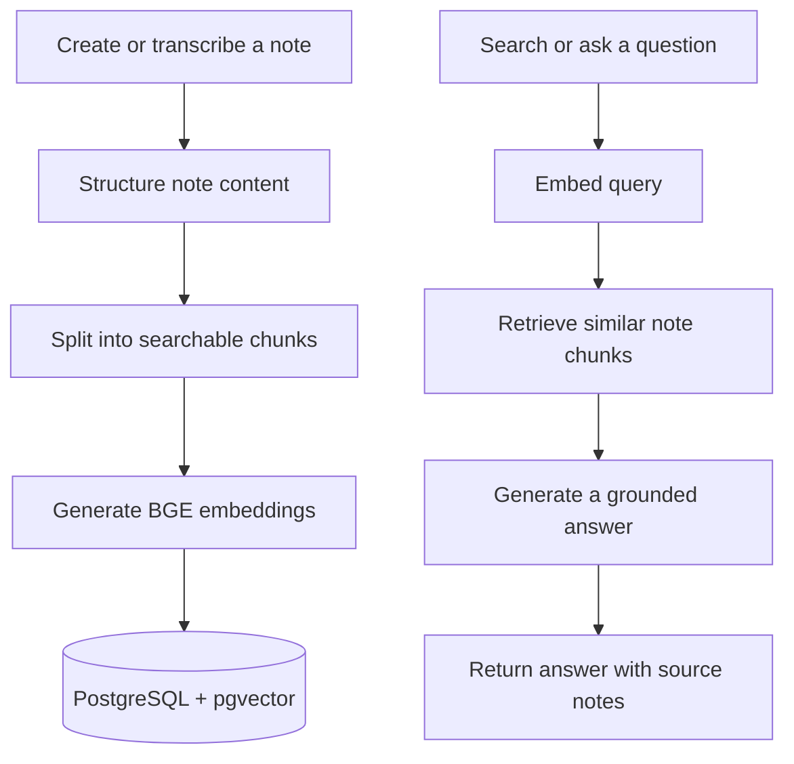

# Noti

**A calm, AI-powered home for your notes and ideas.**

Noti helps you capture thoughts, organize them into useful notes, and find them again by meaning—not just by matching keywords. It combines a focused note-taking experience with AI-assisted note structuring, semantic search, and answers grounded in your notes.

## What you can do

- Create, edit, organize, and revisit notes.
- Turn a transcript into a structured note with a title, summary, tags, and action items.
- Search note content using semantic similarity.
- Ask questions about your notes and get answers with links to relevant source notes.
- Capture spoken thoughts through the voice-to-transcription workflow.
- Keep your notes and their search data in PostgreSQL with pgvector.

## How the AI knowledge flow works

When a note is prepared for semantic retrieval, Noti splits its content into smaller chunks, generates a vector embedding for each chunk, and stores those vectors alongside the note data. Noti uses the local `Xenova/bge-small-en-v1.5` embedding model for this step.

For a search or question, Noti embeds the query and compares it with stored note vectors using cosine similarity. For question answering, relevant chunks are passed to the language model as source material; the response includes the notes it used.



## Technology

- [Next.js](https://nextjs.org/) and React
- TypeScript and Tailwind CSS
- [Clerk](https://clerk.com/) authentication
- PostgreSQL with [pgvector](https://github.com/pgvector/pgvector), accessed through Drizzle ORM
- Hugging Face Inference for language-model generation
- Hugging Face Transformers with the bundled BGE model for embeddings

## Run locally

### Requirements

- Node.js 20.9 or later
- npm
- A Clerk application
- A PostgreSQL database with the pgvector extension
- A Hugging Face access token for AI generation

### Setup

1. Clone the repository and install dependencies:

   ```bash
   git clone https://github.com/Edjemoknine/noti.git
   cd noti
   npm install
   ```

2. Add the credentials for your local environment. Create `.env.local` for Next.js and `.env` for Drizzle Kit:

   ```dotenv
   # .env.local
   NEXT_PUBLIC_CLERK_PUBLISHABLE_KEY=your_clerk_publishable_key
   CLERK_SECRET_KEY=your_clerk_secret_key
   HF_TOKEN=your_hugging_face_token

   # .env (used by Drizzle Kit)
   DATABASE_URL=your_postgresql_connection_string
   ```

   Keep real credentials out of version control. The repository ignores `.env` files.

3. Start the development server:

   ```bash
   npm run dev
   ```

4. Open [http://localhost:3000](http://localhost:3000).

Available project scripts:

| Command         | Description                          |
| --------------- | ------------------------------------ |
| `npm run dev`   | Start the Next.js development server |
| `npm run build` | Create a production build            |
| `npm run start` | Serve the production build           |
| `npm run lint`  | Run ESLint                           |

## Project layout

```text
actions/       Note-related server actions
app/           Next.js routes, pages, and API endpoints
components/    UI and note-taking components
db/            Drizzle schema and database migrations
docs/          AI workflow and embeddings documentation
lib/           Embedding, chunking, retrieval, and AI helpers
models/        Bundled local embedding model
```

## AI implementation notes

- **Chunking:** note text and metadata are split into smaller passages for retrieval.
- **Embeddings:** the bundled BGE small English model creates 384-dimensional vectors.
- **Vector search:** pgvector stores note embeddings and supports cosine-similarity retrieval.
- **Grounded answers:** retrieved passages are provided to the language model so responses can be based on the user's notes.
- **Structured generation:** the AI note workflow extracts a title, summary, note content, tags, and actionable items from a transcript.

For more detail, see [the embeddings guide](./docs/embeddings.mdx) and [the AI process guide](./docs/Ai-process.mdx).

## Roadmap

The project notes outline possible next steps, including background processing with retries, hybrid keyword-and-semantic retrieval, reranking, and expanded AI workflows. These are planned improvements, not claims about current functionality.

## License

No license is currently specified in this repository.
